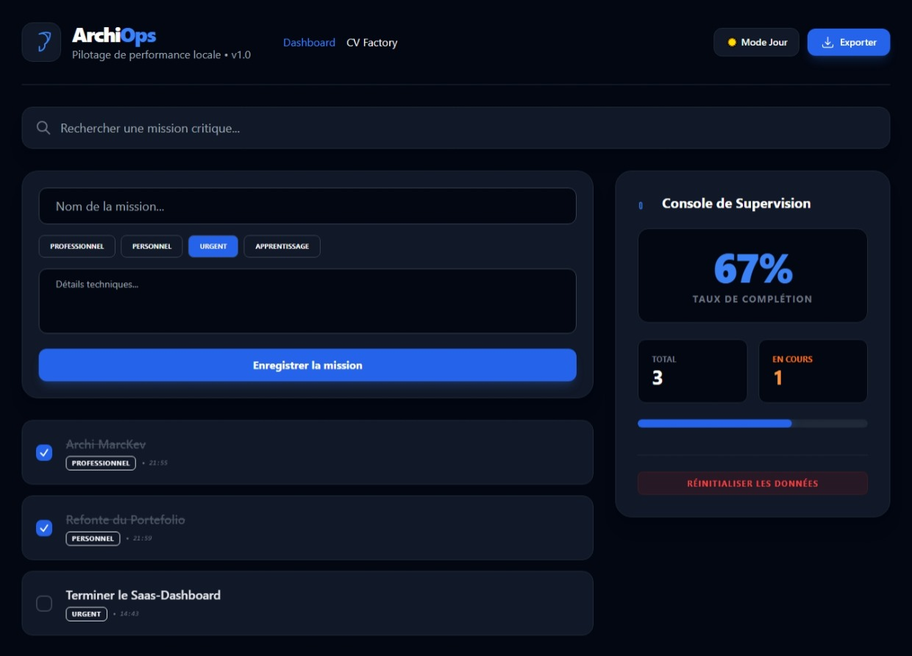
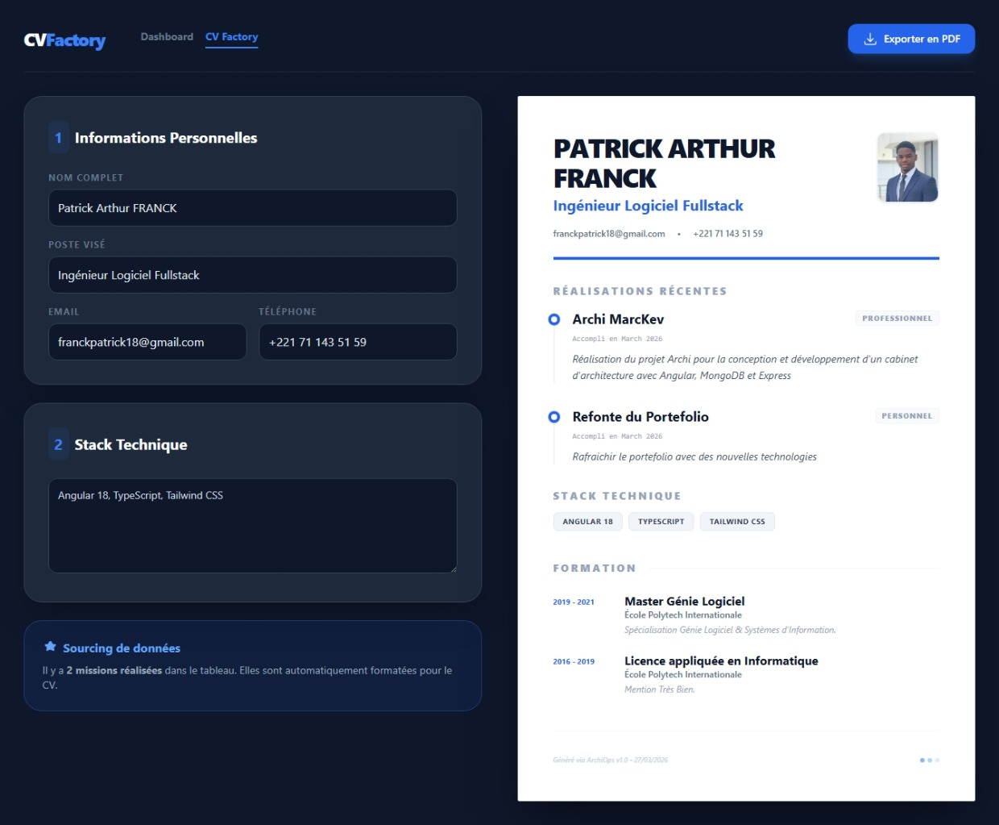

#  ArchiOps v1.0

**ArchiOps** est une console de pilotage de performance locale conçue pour les développeurs et architectes solutions. Elle centralise la gestion des missions critiques et la génération de documentation technique (CV Factory).


---

##  Fonctionnalités Clés

###  Console de Supervision (Dashboard)
- **Gestion de Missions** : Système CRUD complet pour suivre les tâches critiques.
- **Catégorisation Intelligente** : Distinction entre missions Professionnelles, Personnelles, Urgentes et Apprentissage.
- **Suivi de Performance** : Barre de progression en temps réel et calcul du taux de complétion.
- **Mode Sombre Natif** : Interface optimisée pour la concentration nocturne.

###  CV Factory (ArchiStudio)
- **Générateur Automatique** : Création de CV orientés "ingénieur" à partir de données structurées.
- **Export PDF** : Exportation directe des documents pour soumission client.

##  Stack Technique

- **Framework** : Angular 18 (Standalone Components)
- **Styling** : Tailwind CSS & SCSS (Architecture modulaire)
- **Routing** : `app.routes.ts` pour une navigation fluide
- **Storage** : Persistance locale via `LocalStorage` pour une autonomie totale sans backend.

##  Installation & Lancement

1. **Cloner le projet**
   ```bash
   git clone https://github.com/patrickfranck18/archi-ops.git


